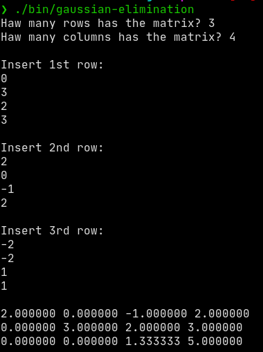

# Gaussian Elimination

Implementation of Gaussian Elimination algorithm for Linear Algebra in C. To run the project follow the Quick Start.

## Quick Start
Run the following commands on terminal:

```console
$ make
$ ./bin/gaussian-elimination
```

The execution's gonna look like this:



It's still a lil bit scuffed but I'm gonna improve it over time. It's a learning project btw.
